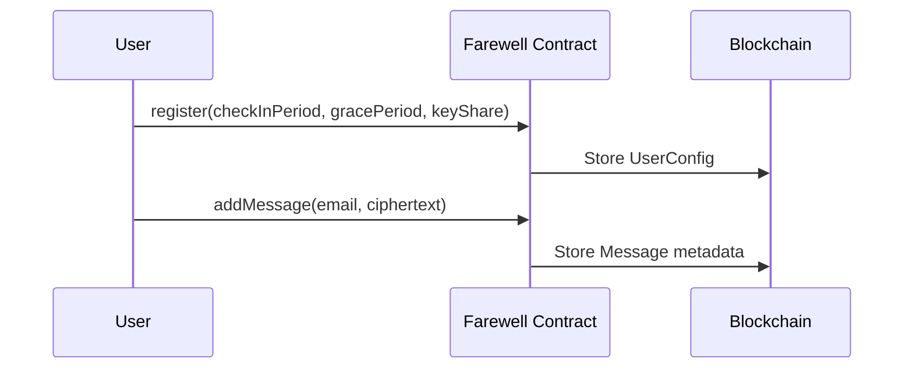
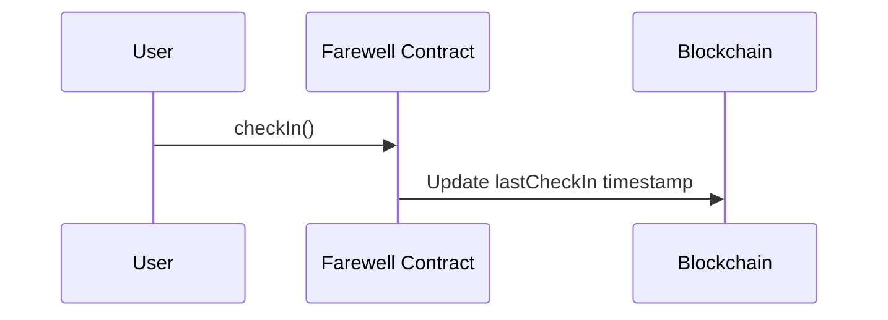
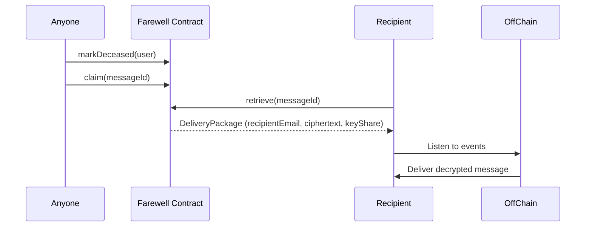

# Farewell       
<p align="center">  </p>

**Farewell** is a proof-of-concept decentralized application (dApp) that allows people to leave **posthumous encrypted messages** to their loved ones.  
It uses **smart contracts** on top of the [fhevm](https://github.com/zama-ai/fhevm) to securely store encrypted data, enforce liveness checks, and release messages only after a configurable timeout.

Because it is deployed as a smart contract on a blockchain (such as Ethereum), **Farewell inherits the reliability and persistence of decentralized infrastructure**. This means the system is designed so that it will keep functioning for decades without depending on a single server or authority, and messages cannot be lost or tampered with once stored.

---

## ✨ Features

- **Check-in mechanism**:  
    Each user sets a `checkInPeriod` (e.g. 6 months) and must periodically call `checkIn()` to prove they are still alive.
    
- **Grace period**:  
    After `checkInPeriod` expires, a `gracePeriod` allows for unexpected delays before being marked deceased.
    
- **Deceased flagging**:  
    If the user does not check in during both periods, anyone may call `markDeceased()` to change the user’s status.
    
- **Encrypted messages**:  
    Users can upload encrypted messages with associated recipients. Messages contain:
    
    - Encrypted recipient’s email (string treated as an array of euint)
        
    - Encrypted message data (treated as locally-encrypted ciphertext)
        
    - A private share of the user’s decryption key (kept as an `euint` so it remains hidden until revealed)
        
- **Delivery mechanism**:  
    After the user is flagged as deceased:
    
    - Anyone may call `claim()` to mark a message as ready for release.
        
    - Recipients (or external services) can then call `retrieve()` (view) to obtain a **DeliveryPackage** containing:
        
        - Recipient’s email
            
        - Ciphertext with the message
            
        - Key share
            
- **Blockchain persistence**:  
    By running entirely as a smart contract on a blockchain such as Ethereum, **Farewell ensures that the system continues to operate reliably for decades**, independent of any central operator, and that **no messages can be lost once stored**.
    

---

## ⚠️ Notes & Limitations

- All **data must be encrypted client-side** before being stored on-chain.  
    We recommend using [GPG](https://gnupg.org/) for encryption.
    
- To **save gas costs**, messages should be **compacted** before submission (e.g., archive + compress with `tar` and `gzip`).
    
- On-chain data is **public**.
    
    - The submitted message is visible, that's why they are are meant to be pre-encrypted client-side.
        
    - Key shares are stored as **encrypted integers (`euint`)**, which remain hidden until released.
        
- This is a **Proof-of-Concept** only.  
    Not production-ready, no guarantees of security, privacy, or delivery.
    

---

## 📂 Project Structure

```
farewell/  
├── assets/
│   └── logo.png       
├── contracts/  
│   └── Farewell.sol       # Core smart contract  
├── test/  
│   └── Farewell.t.js      # Hardhat tests  
├── hardhat.config.ts      # Hardhat setup  
├── package.json  
└── README.md              # This file
```

---

## 🚀 Usage

### Test and Deploy

```bash
npx hardhat compile
npx hardhat test
npx hardhat deploy --network <network>
```

### Interact

In Hardhat console:

```bash
npx hardhat console --network <network>
```


---

## 🔐 Workflow

### 1. User registers

- Defines `checkInPeriod` + `gracePeriod`
    
- Stores encrypted key share
    

### 2. User adds messages

- Each message contains recipient email and ciphertext
    

### 3. User stays alive

- Calls `checkIn()` periodically
    

### 4. Timeout occurs

- Anyone may call `markDeceased()`
    

### 5. Messages are claimed and retrieved

- `claim()` marks the message as ready
    
- `retrieve()` (view) returns a **DeliveryPackage**:  
    `(recipientEmail, ciphertext, keyShare)`
    
- Off-chain system delivers and decrypts messages
    

---

## 📊 Sequence Diagrams

### Register & Add Message



---

### Check-in Flow



---

### Mark as Deceased & Delivery



---

## 🔧 Encrypting & Compacting Data

All data stored on-chain should be **encrypted and compacted** to reduce storage costs and keep confidentiality.

### Encrypt and Compact

```bash
# Encrypt with GPG
gpg --symmetric --cipher-algo AES256 message.txt

# Pack + compress the encrypted file
tar -czf message.tar.gz message.txt.gpg
```

### Hex-encode for Contract Submission

```bash
# Encode to hex (Linux/Unix)
xxd -p message.tar.gz | tr -d '\n' > message.hex
```

Now you can pass the contents of `message.hex` (prefixed with `0x`) to `addMessage()`.

Example:

```js
await Farewell.addMessage("alice@example.com", "0x" + hexString);
```

### Recover Message

```bash
# Decode from hex
xxd -r -p message.hex > message.tar.gz

# Extract the archive
tar -xzf message.tar.gz

# Decrypt with GPG
gpg --decrypt message.txt.gpg
```

---

### 🔑 Obtaining the Secret Key Share

_(todo: add detailed explanation of how to export and provide the encrypted share for the contract)_

---

## 🔮 Future Extensions

Farewell can be extended with **zero-knowledge proofs (ZKPs)** to add stronger guarantees of delivery:

- **Proof of email delivery**:  
    By integrating [zk.email](https://docs.zk.email/architecture/on-chain), a recipient (or service) could prove on-chain that the encrypted message was actually submitted to an email provider.  
    This would allow `claim()` not only to release a DeliveryPackage, but also to **reward the claimer** once they provide a valid delivery proof.
    
- **Privacy-preserving claims**:  
    ZKPs could allow recipients to prove ownership of an email (or account) without revealing it on-chain, enhancing privacy.
    
- **Incentive mechanisms**:  
    Rewards could be tied to proofs, ensuring that only successful delivery attempts are compensated.
    

This functionality is **not implemented yet**, but is a natural evolution of the Farewell project.

---

## 📜 License

MIT
